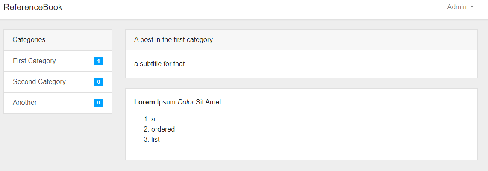
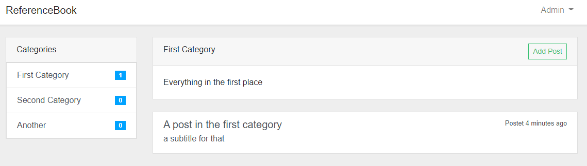

# Reference Book App
** Laravel tutorial project **

Create Wiki Documentation, Blog posts, FAQ Websites and much more...

## Basic concept (how it works)
This Laravel 8 App loads dynamic content Posts by Category content from the Database (or any datasource you like).

- The app has a Model for Category and Posts. Each Post has a Category, Each Category has meny posts.
- The sidebar navigation shows each category and the number of posts in the view created by the AppServiceProvide::class register method.

## Installation (Development mode)
1. Clone the repository
    `git clone https://github.com/michitheonlyone/refbook-laravel.git`

2. Install composer and npm
    `composer install`
    `npm install`

3. Setup environment.
    `cp .env.example .env`

4. Setup database and change necessary variables!
    `php artisan key:generate`
    `php artisan migrate`

5. Serve it!
    `php artisan serve`

## Screenshots

