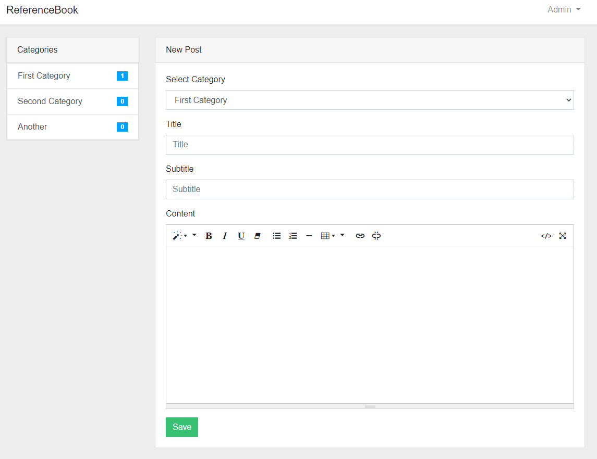

# Reference Book App
Create Wiki Documentation, Blog posts, FAQ Websites, Multi-User Notebook App and much more...

## Basic concept (how it works)
This Laravel 8 App loads dynamic content Posts by Category content from the Database (or any datasource you like).

- The app has a Model for Category and Posts. Each Post has a Category, Each Category has meny posts.
- The sidebar navigation shows each category and the number of posts in the view created by the AppServiceProvide::class register method.

## Installation (Development)
For deployment head over to the [Laravel Doc's](https://laravel.com/docs/8.x/deployment)

```bash
# Clone the repository
git clone https://github.com/michitheonlyone/refbook-laravel.git

# Install composer and npm dependencies
composer install
npm install

# Setup environment.
cp .env.example .env

# Setup database and change necessary variables!
php artisan key:generate
php artisan migrate

# Serve it!
php artisan serve
```

## Screenshots



